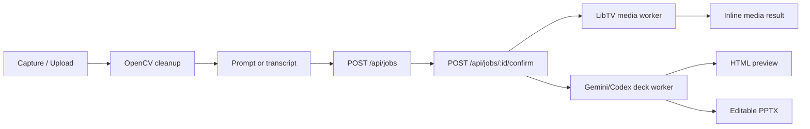
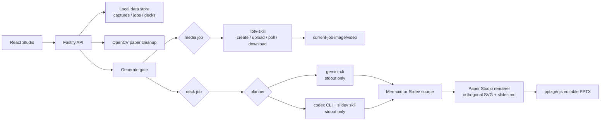

# Paper Studio Architecture

## Runtime Shape

Paper Studio runs as a local two-process app:

- Vite React frontend on `http://127.0.0.1:5173`
- Fastify API on `http://127.0.0.1:8787`

The frontend is the studio surface. The backend owns camera access, filesystem persistence, OpenCV cleanup, provider orchestration, deck generation, and local file saving.

## Core Modules

| Area | Files | Responsibility |
| --- | --- | --- |
| Studio UI | `src/App.jsx`, `src/styles.css` | Capture/review/intent/generate workflow, camera chips, style chips, deck controls, inline results |
| Frontend API | `src/api.js` | Thin fetch wrappers for capture, source upload, jobs, transcripts, cameras |
| Camera source logic | `src/camera.js`, `server/index.js`, `server/preflight.js` | Rank Desk View / Continuity / built-in / screen capture sources and expose AVFoundation inventory |
| Capture cleanup | `scripts/clean_paper.py` | Paper ROI detection, perspective or bounding-box crop, line cleanup, safe fallback |
| Local storage | `server/storage.js` | Runtime directories, stable ids, JSON persistence, `/data/` URL mapping |
| Jobs | `server/jobs.js` | Draft creation, confirm gate, provider defaults, source context policy |
| LibTV media | `server/libtv.js` | Sketch-to-image/video prompting, low-cost defaults, result filtering by job marker |
| Deck worker | `server/deck.js` | Gemini/Codex planning, source scan injection, Mermaid extraction, orthogonal preview, editable PPTX |
| Source folders | `server/sources.js` | Browser folder upload manifest and bounded text excerpts |
| Speech | `src/audio.js`, `server/transcribe.js` | Browser recording and optional Whisper CLI transcription |

## Job Lifecycle

`Generate` in the UI performs draft creation followed by confirmation. The backend still preserves the draft/confirm boundary so capture and draft creation never consume provider quota.

## Skill Invocation Architecture

Runtime skill contracts are documented in [`docs/SKILLS.md`](SKILLS.md). Private local skill folders are intentionally not vendored into this repository.

## Flowchart Output Path

For `Sketch to Deck -> Flowchart page`:

1. Copy the cleaned capture into `data/decks/{jobId}/input.png`.
2. Ask Gemini CLI or Codex CLI for Mermaid `flowchart TD/LR` semantics.
3. Repair or fallback to best-effort Mermaid if the CLI fails.
4. Parse Mermaid into a graph spec: nodes, edges, labels, direction, shapes.
5. Render an orthogonal SVG/HTML preview.
6. Generate `editable-flowchart.pptx` with `pptxgenjs` using native shapes and Manhattan line segments.
7. Save requested artifacts to `~/Downloads` through `POST /api/jobs/:id/save/:asset`.

The preview intentionally avoids Mermaid auto-layout for the final visible graph. Mermaid remains the semantic source, while the backend renderer controls line routing and editability.

## Source Folder Policy

Source folders are optional. A selected folder is only scanned and injected when `sourcePolicy` resolves to use context.

Default policy: `auto`.

The prompt must mention reference/source intent, such as:

- `参考`
- `资料`
- `文件夹`
- `文档`
- `source`
- `folder`
- `docs`
- `based on`

If the prompt does not ask for source grounding, the selected folder is ignored. This keeps sketch-first generation from being polluted by unrelated local documents.

## Local Data Policy

Runtime data is local-only:

- `data/captures/`
- `data/transcripts/`
- `data/jobs/`
- `data/results/`
- `data/decks/`
- `data/source-uploads/`

These directories are ignored by git. They may contain private camera frames, speech transcripts, prompts, or generated media.

## Cost And Provider Policy

- No provider call happens during capture or draft creation.
- LibTV, Gemini CLI, and Codex CLI run only after `Generate`.
- Missing provider setup appears as a setup-blocker, not a silent fallback.
- Google Cloud / Vertex / API key pay-as-you-go routes are not enabled by default.
- Video and image prompts use conservative defaults unless the user explicitly selects otherwise.
