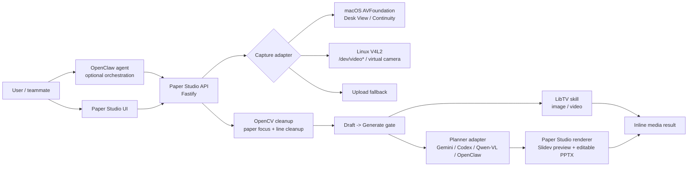

# Linux And OpenClaw Migration Plan

## Summary

Paper Studio can be migrated to Linux, but the migration should be treated as a platform-adapter pass rather than a simple install script.

The current prototype has two layers:

1. Portable generation layer: React, Fastify, OpenCV cleanup, upload fallback, LibTV media generation, Gemini/Codex deck planning, Slidev preview, and editable PPTX output.
2. macOS capture layer: Apple Desk View, Continuity Camera, AVFoundation camera listing, AVFoundation still capture, and the `.command` launcher.

Linux can run the generation layer first. The Desk View capture layer must be replaced by Linux camera sources such as V4L2 USB cameras, phone-as-webcam devices, OBS virtual camera, IP camera, or plain upload fallback.

OpenClaw can be used, but it should sit above Paper Studio as an agent orchestration layer or skill wrapper. It should not duplicate Paper Studio's backend logic.

## Recommended Target Shape



## What Works On Linux With Minimal Changes

| Area | Linux status | Notes |
| --- | --- | --- |
| Frontend | Should work | Vite/React has no macOS dependency. |
| Backend API | Should work | Fastify and Node APIs are portable. |
| Upload image fallback | Should work | Best first Linux demo path. |
| OpenCV cleanup | Should work | Requires Python with `cv2` and `numpy`. |
| Source folder upload | Should work | Browser `webkitdirectory` works in Chromium-based browsers. |
| Flowchart page | Should work | Backend renderer and `pptxgenjs` are portable. |
| Editable PPTX download | Should work | Uses local filesystem and HTTP download headers. |
| LibTV media generation | Should work | Requires `LIBTV_ACCESS_KEY` and a portable `libtv-skill` path. |
| Gemini CLI planner | Should work if installed | Must be on `PATH` or configured through an env var. |
| Codex CLI planner | Depends on Linux availability | Current fallback path points to macOS `Codex.app`; Linux needs `CODEX_BIN` or another planner. |

## macOS Assumptions That Must Be Removed

| Current assumption | Current file area | Linux replacement |
| --- | --- | --- |
| `ffmpeg -f avfoundation` for listing cameras | `server/preflight.js` | `v4l2-ctl --list-devices` or `/dev/video*` discovery |
| `ffmpeg -f avfoundation` for snapshots and preview | `server/index.js` | `ffmpeg -f v4l2 -i /dev/videoN` |
| Apple Desk View / Continuity Camera names | `src/camera.js`, `server/models.js`, tests | Generic ranked source inventory with labels from OS/device |
| `/opt/homebrew/bin/ffmpeg` fallback | `server/preflight.js`, `server/index.js` | `PAPER_STUDIO_FFMPEG` or `PATH` |
| `/Users/hmi/.agents/skills/libtv-skill/scripts` | `server/libtv.js`, `server/preflight.js` | `LIBTV_SKILL_DIR` |
| `/Users/hmi/.local/bin/gemini` | `server/preflight.js`, `server/deck.js` | `GEMINI_BIN` or `PATH` |
| `/Applications/Codex.app/.../codex` | `server/preflight.js`, `server/deck.js` | `CODEX_BIN` or OpenClaw planner adapter |
| `/Users/hmi/.local/bin/whisper` | `server/preflight.js`, `server/transcribe.js` | `WHISPER_BIN` or manual transcript |
| `Start Paper Studio Camera.command` | README and local launcher | `scripts/linux-dev.sh` or `npm run dev` |

## Linux Dependency Baseline

Recommended Ubuntu/Debian baseline:

```bash
sudo apt update
sudo apt install -y ffmpeg v4l-utils python3 python3-pip
python3 -m pip install opencv-python numpy
```

Node should be installed through `nvm`, `fnm`, or another current Node manager so the project can run Node 24+:

```bash
npm install
npm run lint
npm run build
npm run test:smoke
```

For camera diagnostics:

```bash
v4l2-ctl --list-devices
ffmpeg -hide_banner -f v4l2 -list_formats all -i /dev/video0
```

## Environment Variable Contract

The Linux pass should make these variables first-class:

| Variable | Purpose |
| --- | --- |
| `PAPER_STUDIO_CAMERA_BACKEND=auto\|avfoundation\|v4l2\|none` | Select capture backend. |
| `PAPER_STUDIO_CAMERA_DEVICES=/dev/video0,/dev/video2` | Optional Linux camera allowlist. |
| `PAPER_STUDIO_FFMPEG=/usr/bin/ffmpeg` | Override ffmpeg path. |
| `PAPER_STUDIO_PYTHON=/usr/bin/python3` | Existing Python override for OpenCV. |
| `LIBTV_SKILL_DIR=/home/user/.agents/skills/libtv-skill/scripts` | Portable LibTV skill path. |
| `LIBTV_ACCESS_KEY=...` | Enables confirmed LibTV calls. |
| `GEMINI_BIN=gemini` | Gemini CLI path. |
| `CODEX_BIN=codex` | Codex CLI path, if available on Linux. |
| `WHISPER_BIN=whisper` | Whisper CLI path, optional. |
| `PAPER_STUDIO_DOWNLOAD_DIR=/home/user/Downloads` | Optional download target override. |

Do not require these for upload-only smoke tests. Missing live providers should appear as disabled provider paths, not as app crashes.

## OpenClaw Integration Strategy

### Recommended: API Bridge

OpenClaw should call Paper Studio's local API. This keeps one source of truth for capture cleanup, draft/confirm safety, provider routing, previews, and downloads.

Useful API flow:

1. `POST /api/captures` for upload-based capture.
2. `POST /api/sources/folder-upload` only when source context is needed.
3. `POST /api/jobs` to create a draft.
4. `POST /api/jobs/:id/confirm` to perform the explicit generation action.
5. `GET /api/jobs/:id` to poll result state.
6. `POST /api/jobs/:id/save/:asset` to save `slides.md`, `diagram.mmd`, or `editable-flowchart.pptx`.

User impact: OpenClaw can automate the workflow without bypassing the confirmation gate or forking Paper Studio's product logic.

### Alternative: Paper Studio As An OpenClaw Skill

Expose a thin OpenClaw skill with actions:

- `create_capture_from_file`
- `create_media_job`
- `create_flowchart_job`
- `confirm_job`
- `poll_job`
- `save_deck_asset`

Each action should call the Paper Studio API instead of rewriting backend logic.

### Optional: OpenClaw As Planner Provider

Paper Studio can add a `deckEngine = openclaw-planner` provider later.

Expected planner contract:

```text
input: job workspace with input.png + intent + optional source excerpts
output: Mermaid flowchart source or Slidev markdown on stdout/json
side effects: none
```

This is also where Qwen-VL can fit. The backend does not care whether the planner is Gemini, Codex, Qwen-VL, or OpenClaw, as long as the output contract is the same.

## Migration Phases

### Phase 1: Make Paths Portable

Tasks:

- Add env-based command resolution for `LIBTV_SKILL_DIR`, `GEMINI_BIN`, `CODEX_BIN`, `WHISPER_BIN`, and `PAPER_STUDIO_FFMPEG`.
- Keep current macOS fallback paths for the original machine.
- Update `/api/health` so the UI shows which exact command path is active.
- Update docs and smoke tests to cover env overrides.

Acceptance:

- App still works on macOS without new env vars.
- Linux can run `npm run test:smoke` without any `/Users/hmi` path.
- Missing optional tools are reported as unavailable, not fatal.

### Phase 2: Add Camera Backend Abstraction

Tasks:

- Introduce `server/cameras/index.js`.
- Add `MacAvfoundationCameraProvider`.
- Add `LinuxV4L2CameraProvider`.
- Add `UploadOnlyCameraProvider`.
- Normalize source records to `{ id, label, kind, backend, devicePath, index }`.
- Keep UI camera chips unchanged from the user's point of view.

Acceptance:

- macOS still lists Desk View / Continuity / screen sources.
- Linux lists `/dev/video*` devices when available.
- Upload-only mode works when `PAPER_STUDIO_CAMERA_BACKEND=none`.

### Phase 3: Linux Capture And Preview

Tasks:

- Implement Linux still capture with `ffmpeg -f v4l2`.
- Implement Linux preview with either MJPEG polling or browser-native `getUserMedia`.
- Prefer still-frame polling over long-lived device locks when device contention is common.
- Add camera error messages that mention `v4l2-ctl`, device permissions, and competing camera apps.

Acceptance:

- Linux USB/virtual webcam can capture one frame.
- If the camera is locked or unavailable, upload fallback remains usable.
- No provider call happens when camera capture fails.

### Phase 4: OpenClaw Bridge

Tasks:

- Add `docs/openclaw-api-flow.md` or a small `openclaw/` example wrapper.
- Provide a minimal OpenClaw action manifest that calls the Paper Studio API.
- Keep all external provider execution behind `POST /api/jobs/:id/confirm`.
- Add a mock provider example for offline demos.

Acceptance:

- OpenClaw can upload a sketch and create a draft.
- OpenClaw can explicitly confirm and poll a job.
- OpenClaw cannot bypass the generation gate.

### Phase 5: Optional Planner Expansion

Tasks:

- Add `deckEngine = openclaw-planner`.
- Add `deckEngine = qwen-vl` if a Qwen multimodal endpoint or CLI is available.
- Reuse the same planner contract: image + intent + optional source excerpts -> Mermaid or Slidev source.

Acceptance:

- Existing Gemini/Codex routes still work.
- Qwen/OpenClaw planner output can produce the same `diagram.mmd`, preview HTML, and editable PPTX.

## Linux Demo Modes

### Mode A: Upload-Only Demo

Best for the first teammate test.

```bash
PAPER_STUDIO_CAMERA_BACKEND=none npm run dev
```

Flow:

1. Upload a sketch image.
2. Enter intent.
3. Generate image/video or flowchart deck.

This validates the core product without camera complexity.

### Mode B: USB Camera Demo

Flow:

1. Connect an overhead USB camera or phone-as-webcam device.
2. Confirm it appears under `/dev/video*`.
3. Start Paper Studio with `PAPER_STUDIO_CAMERA_BACKEND=v4l2`.
4. Capture and generate.

### Mode C: OpenClaw-Controlled Demo

Flow:

1. Start Paper Studio API.
2. OpenClaw uploads a capture or points to an existing image.
3. OpenClaw creates draft.
4. User or OpenClaw explicitly confirms.
5. OpenClaw polls result and returns links.

## Test Plan

### Mac Regression

```bash
npm run lint
npm run build
npm run test:smoke
```

Manual:

- Desk View capture still works.
- Upload fallback still works.
- LibTV image mock still works.
- Flowchart PPTX still downloads as `.pptx`.

### Linux Upload-Only

```bash
PAPER_STUDIO_CAMERA_BACKEND=none npm run test:smoke
npm run dev
```

Manual:

- Upload a PNG/JPG sketch.
- Confirm OpenCV cleanup completes or falls back safely.
- Generate mock deck or live deck if planner is configured.

### Linux V4L2

```bash
v4l2-ctl --list-devices
PAPER_STUDIO_CAMERA_BACKEND=v4l2 npm run dev
```

Manual:

- Camera chips show Linux camera labels.
- Capture saves raw, crop, and clean image.
- Capture failure does not trigger a provider call.

### OpenClaw

Mock provider first:

```bash
PAPER_STUDIO_MOCK_PROVIDERS=1 npm run dev
```

Then verify:

- OpenClaw can call `/api/health`.
- OpenClaw can upload a file to `/api/captures`.
- OpenClaw can create a draft with `/api/jobs`.
- OpenClaw must call `/api/jobs/:id/confirm` before external generation.
- OpenClaw can fetch `/api/jobs/:id` and save deck assets.

## Risks And Mitigations

| Risk | Impact | Mitigation |
| --- | --- | --- |
| Linux camera permissions | Camera chips empty or capture fails | Document `video` group membership, `v4l2-ctl`, and upload fallback. |
| V4L2 device locking | Preview works but capture fails, or vice versa | Prefer still-frame polling and release ffmpeg between captures. |
| Native npm optional dependencies | Build fails on different CPU/OS | Run fresh `npm install` on the target machine. Do not copy `node_modules`. |
| Codex CLI not available on Linux | `codex-slidev` disabled | Use Gemini CLI, OpenClaw planner, or Qwen-VL adapter. |
| Missing LibTV skill path | Media generation disabled | Configure `LIBTV_SKILL_DIR`; keep mock provider for smoke tests. |
| Source documents accidentally influence sketch-first output | Poor flowchart/media relevance | Preserve `sourcePolicy=auto`; selected folder is ignored unless prompt asks for sources. |

## Definition Of Done

The migration is complete when:

- `npm run test:smoke` passes on Linux without macOS paths.
- Upload-only workflow generates image/deck mock output on Linux.
- V4L2 camera capture works on at least one Linux camera device, or upload-only mode is clearly documented as the supported Linux fallback.
- OpenClaw can drive the API without bypassing `Generate`.
- LibTV and planner providers are configured through env vars, not hardcoded personal paths.
- README and dependency docs point Linux users to this document.

